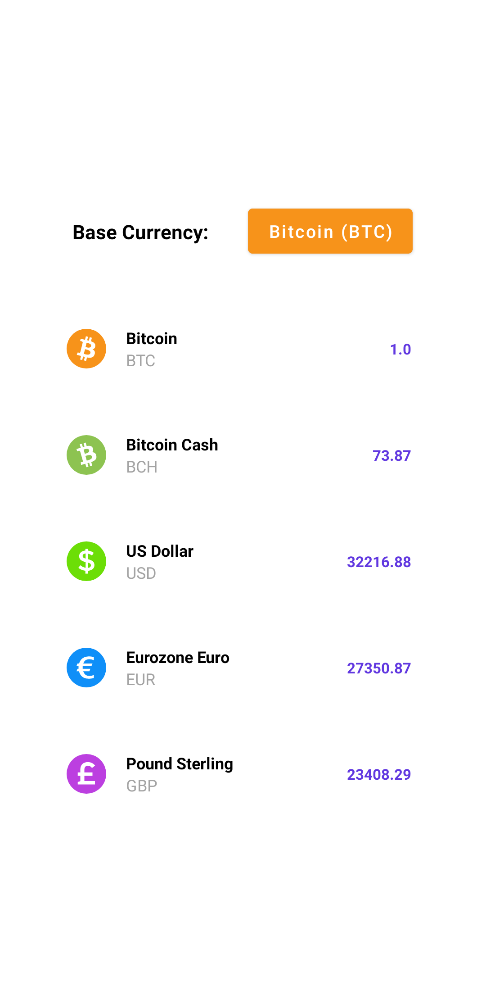
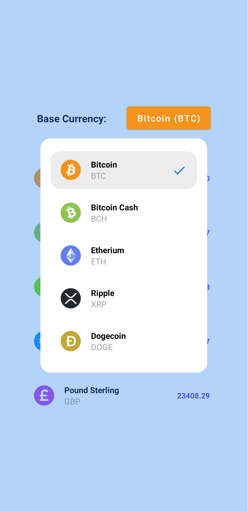
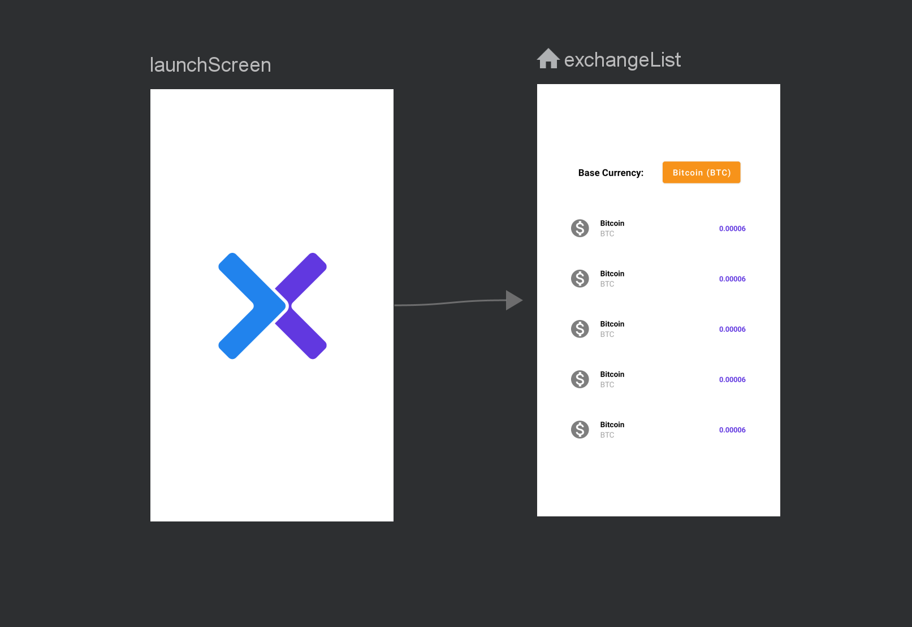

# Crypt-X
App showing usage of newest Android Jetpack and Kotlin language features


## Retrofit & Moshi Usage Example

Two basic reyclerviews were created to show how network requests are made using Retrofit, how the response is handled, and how incoming Json can be parsed with Moshi

, 

*Retrofit just requires a Retrofit.Builder object and an interface to make the request, while Moshi simply needs a model data class.*


### retrofit object

 ```kotlin
private val retrofit = Retrofit.Builder()
            .baseUrl(BASE_URL)
            .addConverterFactory(MoshiConverterFactory.create())
            //.addCallAdapterFactory(CoroutineCallAdapterFactory())
            .client(okHttpClientBuilder.build())
            .build()
```


### interface

 ```kotlin
interface ExchangeRequest {

        @GET("BTC")
        suspend fun getBtcResponse(): Response<ExchangeResponse>

        @GET("BCH")
        suspend fun getBchResponse(): Response<ExchangeResponse>

        @GET("ETH")
        suspend fun getEthResponse(): Response<ExchangeResponse>

        @GET("XRP")
        suspend fun getXrpResponse(): Response<ExchangeResponse>

        @GET("DOGE")
        suspend fun getDogeResponse(): Response<ExchangeResponse>
    }
```


### model data class

 ```kotlin
@JsonClass(generateAdapter = true)
data class Data(
    val code: String?,
    val name: String?,
    val rate: Double?,
    @Transient
    var iconId: Int = 0
)
```


## Navigation Graph Usage Example

A navigation graph is a resource file that contains all of your *destinations* and *actions*. The graph represents app's navigation paths. Navigation occurs between *destinations* (fragments etc.). These destinations are connected via *actions*, which can describe animations, transistions, and more.




